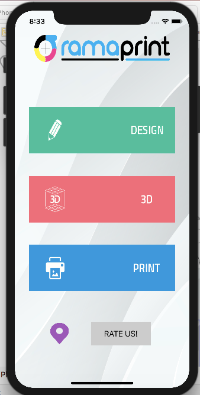
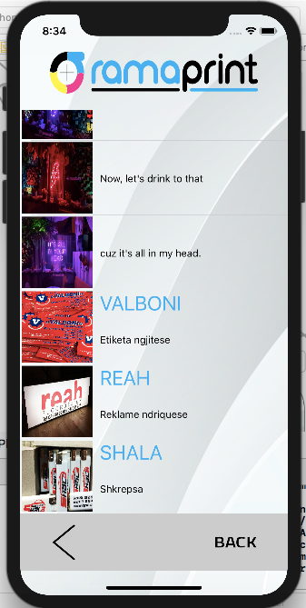
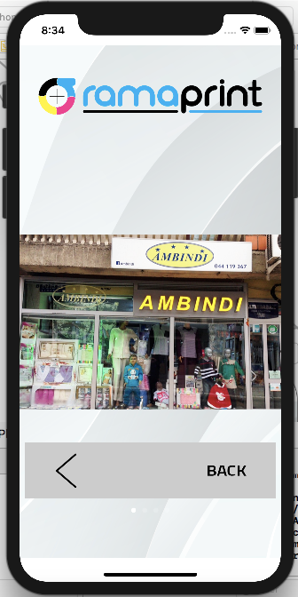
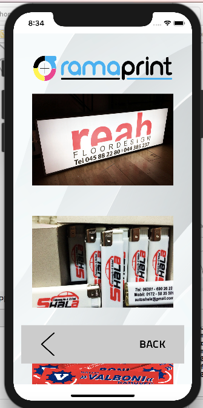
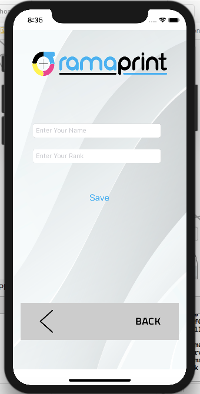

Project in iOS for "RamaPrint".

This project aims to facilitate the company's customers "RamaPrint".

The main purpose is for the application to be user-friendly!

On the first view when you open the aplication, you can see 5 main buttons that can send you to other views:

After you click Design Button you can see "RamaPrint" job's with design:

Design View contain TableView with Cells and Label for title and description, and at the end it's a Back Button that bring you back to main view(Home View).

The Third View contain "RamaPrint" job's with 3D posters and amaizing photo of great job:

Also at this view you can scroll horizontally to see other photos of 3D posters and also at the end Back Button.

Clicking the Print Button it will appear some photos of the printing job's of this amazing company:

And the last button of this aplication is Rate Us button when you can writte your rate about this company, connected with database of company:

And for the Location Button, we are working on it and soon will be ready to use!

For any question please send me email.
My E-mail: adonisdeliu@gmail.com

Thank You!
